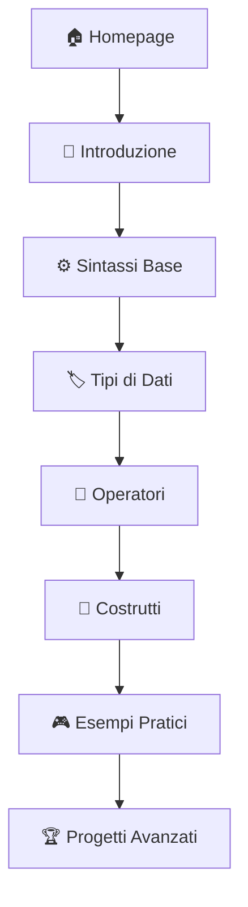

<div align="center">

# 🐍 Python Tutorial Library

**Una libreria interattiva completa per imparare Python da zero**
*Tutorial pratici • Esercizi interattivi • Esempi funzionanti*

---

[](https://phantumblade.github.io/python-tutorial-library)
[](https://opensource.org/licenses/MIT)
[](http://makeapullrequest.com)

</div>

---

## 🎯 **Panoramica del Progetto**

<div align="center">

| **Caratteristica** | **Descrizione** |
|:------------------:|:---------------:|
| 📚 **Tutorial Interattivi** | Guide complete con esempi eseguibili nel browser |
| 💻 **Editor Integrato** | Testa codice Python senza installazioni |
| 🎮 **Esercizi Pratici** | FizzBuzz, Fibonacci, algoritmi e molto altro |
| 📱 **Mobile-First** | Design responsive per tutti i dispositivi |
| 🚀 **Zero Setup** | Inizia subito, nessuna configurazione richiesta |
| 🔓 **Open Source** | Codice libero, contributi benvenuti |

</div>

---

## 📂 **Struttura del Progetto**

```
python-tutorial-library/
├── 🏠 index.html                     # Homepage principale
├── 📁 assets/                        # Risorse condivise
│   ├── 🎨 css/style.css              # Stili globali
│   ├── ⚡ js/common.js               # Funzioni condivise
│   └── 🖼️ images/                    # Immagini e logo
├── 📚 tutorials/                     # Tutorial principali
│   ├── 01-introduzione/
│   │   ├── 📄 python_intro_guide.html
│   │   └── 📄 vantaggi_svantaggi.html
│   ├── 02-sintassi-base/
│   ├── 03-tipi-dati/
│   ├── 04-operatori/
│   ├── 05-costrutti/
│   └── 06-esempi-pratici/
├── 🐍 esempi/                        # Codice Python
│   ├── calcolatrice.py
│   ├── fibonacci.py
│   └── fizzbuzz.py
└── 📖 docs/                          # Documentazione
    └── guida-contribuzione.md
```

---

## 🗂️ **Contenuti Disponibili**

<div align="center">

### 📖 **Tutorial Base**

| **Modulo** | **Argomento** | **Difficoltà** | **Link** |
|:----------:|:-------------:|:--------------:|:--------:|
| **01** | Introduzione a Python | 🟢 Facile | [Inizia →](tutorials/01-introduzione/) |
| **02** | Sintassi di Base | 🟢 Facile | [Vai →](tutorials/02-sintassi-base/) |
| **03** | Tipi di Dati | 🟡 Medio | [Studia →](tutorials/03-tipi-dati/) |
| **04** | Operatori | 🟡 Medio | [Pratica →](tutorials/04-operatori/) |
| **05** | Costrutti | 🔴 Avanzato | [Impara →](tutorials/05-costrutti/) |
| **06** | Esempi Pratici | 🔴 Avanzato | [Applica →](tutorials/06-esempi-pratici/) |

</div>

---

## 🚀 **Quick Start**

<div align="center">

### 🌐 **Metodo 1: Demo Online**
[](https://phantumblade.github.io/python-tutorial-library)

### 💻 **Metodo 2: Locale**

</div>

```bash
# 📥 Clona il repository
git clone https://github.com/phantumblade/python-tutorial-library.git
cd python-tutorial-library

# 🌐 Apri nel browser
open index.html

# 🔧 Oppure avvia un server locale
python -m http.server 8000    # Python 3
python -m SimpleHTTPServer 8000    # Python 2
npx http-server    # Node.js

# 👀 Visita http://localhost:8000
```

---

## 🛠️ **Sviluppo e Personalizzazione**

<div align="center">

### 📋 **Prerequisiti**

| **Strumento** | **Versione** | **Scopo** |
|:-------------:|:------------:|:---------:|
| 🌐 **Browser Moderno** | Latest | Visualizzazione e testing |
| ✏️ **Editor di Testo** | Any | VS Code consigliato |
| 🐍 **Python** | 3.x | Server locale (opzionale) |

</div>

### 🔄 **Workflow di Sviluppo**

```bash
# 1️⃣ Setup iniziale
git clone https://github.com/phantumblade/python-tutorial-library.git
cd python-tutorial-library

# 2️⃣ Crea un branch per le tue modifiche
git checkout -b feature/miglioramento-ui

# 3️⃣ Modifica i file
# Edita tutorial, aggiungi esempi, migliora CSS/JS

# 4️⃣ Testa le modifiche
python -m http.server 8000

# 5️⃣ Commit e push
git add .
git commit -m "✨ Aggiunge nuovo tutorial su decoratori"
git push origin feature/miglioramento-ui

# 6️⃣ Crea Pull Request su GitHub
```

---

## 📚 **Come Utilizzare la Libreria**

<div align="center">

### 🎯 **Percorso di Apprendimento Consigliato**



</div>

### 📝 **Guida Passo-Passo**

1. **🎯 Inizia dalla Homepage**: Panoramica completa del progetto
2. **📖 Segui i Tutorial**: Percorso strutturato dall'introduzione agli esempi
3. **💻 Prova il Codice**: Ogni sezione ha editor integrato per testare
4. **🎮 Fai gli Esercizi**: Sezioni dedicate con soluzioni interattive
5. **🔗 Approfondisci**: Link a risorse esterne e documentazione ufficiale
6. **🤝 Contribuisci**: Migliora i tutorial esistenti o aggiungi nuovi contenuti

---

## 🤝 **Contribuire al Progetto**

<div align="center">

**I contributi sono sempre benvenuti!** 🎉

[](docs/guida-contribuzione.md)

</div>

### 🔄 **Process di Contribuzione**

| **Step** | **Azione** | **Comando** |
|:--------:|:----------:|:-----------:|
| 1️⃣ | Fork del repository | Tramite GitHub UI |
| 2️⃣ | Crea branch feature | `git checkout -b feature/nome-feature` |
| 3️⃣ | Implementa modifiche | Edita i file necessari |
| 4️⃣ | Test delle modifiche | `python -m http.server 8000` |
| 5️⃣ | Commit delle modifiche | `git commit -am "Descrizione chiara"` |
| 6️⃣ | Push del branch | `git push origin feature/nome-feature` |
| 7️⃣ | Crea Pull Request | Tramite GitHub UI |

### 💡 **Idee per Contributi**

<div align="center">

| **Categoria** | **Esempi di Contributi** |
|:-------------:|:------------------------:|
| 🆕 **Nuovi Tutorial** | Classi e oggetti, Librerie (NumPy, Pandas) |
| 🎮 **Esercizi** | Algoritmi di ordinamento, Strutture dati |
| 🌐 **Web Development** | Flask/Django basics, API REST |
| 🔧 **Tools** | Debugging, Testing, Virtual environments |
| 🎨 **UI/UX** | Miglioramenti design, Accessibilità |
| 📖 **Documentazione** | Guide installazione, Best practices |

</div>

---

## 📊 **Statistiche del Progetto**

<div align="center">


</div>

---

## 📄 **Licenza e Credits**

<div align="center">

### 📜 **Licenza**
Questo progetto è rilasciato sotto **[Licenza MIT](LICENSE)**
*Libero per uso personale e commerciale*

### 🙏 **Riconoscimenti**

| **Risorsa** | **Utilizzo** | **Link** |
|:-----------:|:------------:|:--------:|
| 🐍 **Python Software Foundation** | Linguaggio base | [python.org](https://www.python.org/) |
| 🎨 **Font Awesome** | Icone interfaccia | [fontawesome.com](https://fontawesome.com/) |
| 🔧 **Pyodide** | Interprete Python nel browser | [pyodide.org](https://pyodide.org/) |
| 🌐 **GitHub Pages** | Hosting gratuito | [pages.github.com](https://pages.github.com/) |

</div>

---

## 📞 **Contatti e Supporto**

<div align="center">

### 👤 **Autore**
**PhantumBlade**

[](https://github.com/phantumblade)

### 🆘 **Supporto**

| **Tipo di Supporto** | **Dove Trovarlo** |
|:--------------------:|:------------------:|
| 🐛 **Bug Report** | [GitHub Issues](https://github.com/phantumblade/python-tutorial-library/issues) |
| 💡 **Feature Request** | [GitHub Discussions](https://github.com/phantumblade/python-tutorial-library/discussions) |
| 📖 **Documentazione** | [Wiki del Progetto](https://github.com/phantumblade/python-tutorial-library/wiki) |

</div>

---

<div align="center">

### ⭐ **Ti è piaciuto questo progetto?**

**Lascia una stella su GitHub e condividilo con i tuoi amici!**

[](https://github.com/phantumblade/python-tutorial-library)
[](https://twitter.com/intent/tweet?text=Scopri%20Python%20Tutorial%20Library%20-%20Una%20libreria%20interattiva%20per%20imparare%20Python!&url=https://github.com/phantumblade/python-tutorial-library)

---

**Fatto con ❤️ per la community Python italiana**

*Ultimo aggiornamento: Luglio 2025*

</div>
